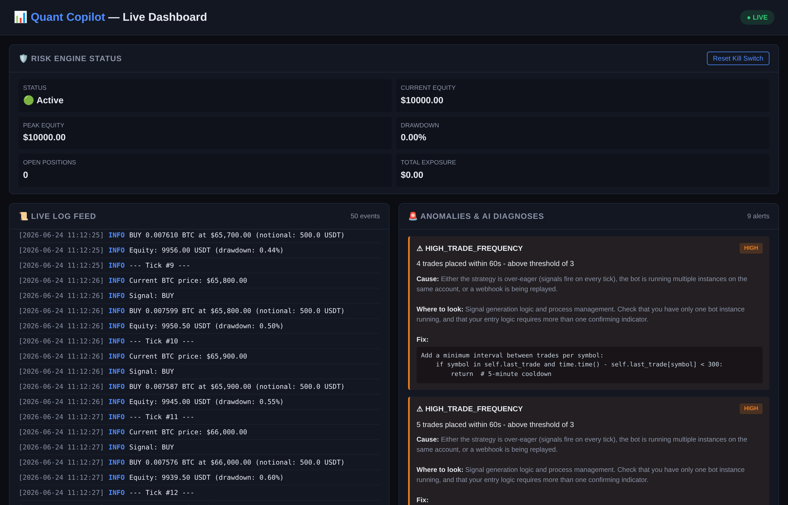

# 📊 Quant Copilot

> **AI debugging copilot for crypto trading bots.**
> Built for the **Bitget AI Hackathon Genesis S1** · Track: *Trading Infrastructure* · Theme: *KI × Krypto*

[](tests/)
[](https://www.python.org)
[](LICENSE)
[](https://www.bitget.com/api-doc/common/intro)

---

## 🎯 The Problem

Every quant developer has lived through this:

- Bot trades overnight, loses money, and you don't know why
- A bug fires the same trade 200 times in a row
- Bitget API rate limits silently throttle your strategy
- Drawdowns hit double digits before you notice
- A position is opened twice because nobody checked `has_position` first

Existing tools give you **monitoring** ("your bot is down"). They don't tell you **why** or **how to fix it**, and they don't put a hard gate between your strategy and the order book.

## 💡 The Solution

**Quant Copilot** is the dev tool that finally lets you sleep:

1. 👀 **Watches** your bot's log file in real time
2. 🚨 **Detects** anomalies: infinite loops, drawdowns, rate limits, slippage spikes
3. 🧠 **Diagnoses** them with a senior-dev-level explanation (cause + fix + prevention)
4. 🛡️ **Blocks** bad trades *before* they reach Bitget via a YAML risk policy
5. 🔌 **Plugs into Bitget** with a v2-signed REST adapter so the same risk engine guards live orders

The "AI × Crypto" theme: an AI that watches your AI — and a hard risk gate that stands between it and the exchange.

---

## ✨ Features

| Component                  | What it does                                                                                              |
|----------------------------|-----------------------------------------------------------------------------------------------------------|
| **Log Watcher**            | Tails bot logs in real time. Handles file rotation, truncation, and slow producers.                       |
| **Anomaly Detector**       | Sliding-window detection for infinite loops, sudden drawdowns, API rate limits, slippage spikes, and high trade frequency. |
| **AI Doctor**              | Rule-based diagnosis engine that generates *cause + where to look + how to fix* for every anomaly. LLM-backed swap-in stub included. |
| **Risk Engine**            | YAML-defined risk policies. Pre-trade gatekeeper that blocks orders exceeding position size, daily loss, rate limits, drawdown, etc. |
| **Live Dashboard**         | FastAPI + WebSocket UI showing live logs, anomalies with AI diagnoses, and risk engine state.             |
| **Bitget v2 Adapter**      | Minimal HMAC-signed REST client + `BitgetBotRunner` that places orders only when the RiskEngine says so. Public WebSocket helper for tickers / candles. |

---

## 🖼️ Screenshot

The dashboard running during the demo, capturing the bot's infinite loop in real time:



> *The dashboard auto-scrolls, color-codes severity, and shows the AI diagnosis inline with each anomaly. The risk panel tracks equity, drawdown, and open positions live.*

---

## 🏗️ Architecture

```
                ┌──────────────────────────────────────────────────┐
                │                User / Strategy Code             │
                └───────────────┬──────────────────────────────────┘
                                │  BitgetBotRunner.evaluate() / place()
                                ▼
                ┌──────────────────────────────────────────────────┐
                │                RiskEngine  (risk_engine.py)     │
                │   YAML policy -> verdict {allowed, rule, reason}│
                └─────┬───────────────────────────────────┬───────┘
                      │ allowed                          │ blocked
                      ▼                                  ▼
            ┌──────────────────────┐         ┌──────────────────────┐
            │ BitgetClient         │         │ OrderResult          │
            │ (exchanges/bitget_)  │         │ {submitted:false}    │
            │ POST /place-order    │         │ log + return         │
            └─────────┬────────────┘         └──────────────────────┘
                      │
                      ▼
                Bitget exchange (REST v2)

  In parallel — observable plane:
  ─────────────────────────────────
   Trading bot log file
        │
        ▼
   LogWatcher (watcher.py)  ──rotates──▶  AnomalyDetector (detector.py)
        │                                         │
        │ parsed events                            │ anomalies
        ▼                                         ▼
   FastAPI dashboard  ◀──── WebSocket /api/ws ─── AI Doctor (ai_doctor.py)
   (dashboard.py)
```

See [`docs/architecture.md`](docs/architecture.md) for the full breakdown.

---

## 🚀 Quickstart

### 1. Install

```bash
git clone https://github.com/hasbunallah01/quant-copilot.git
cd quant-copilot
python -m venv .venv && source .venv/bin/activate
pip install -r requirements.txt
```

### 2. Verify it works

```bash
pytest -v
# expected: 39 / 39 passing
```

### 3. Run the dashboard

```bash
python -m copilot.dashboard
```

Open **http://localhost:8000** in your browser.

### 4. Run the demo bot (separate terminal)

```bash
python demo_bot/bot.py
```

Watch the dashboard detect the bot's intentional infinite-loop bug within seconds, generate an AI diagnosis, and block subsequent trades via the risk engine.

### 5. Wire it into your own bot

Add this single line before placing any order:

```python
import requests
result = requests.post("http://localhost:8000/api/check-trade", json={
    "symbol": "BTC/USDT",
    "side": "BUY",
    "quantity": 0.5,
    "price": 65000,
    "account_equity": 10000,
}).json()
if not result["allowed"]:
    print("BLOCKED:", result["reason"])
    return
# else: place the order
```

That's it. The risk engine is now your pre-trade gatekeeper.

### 6. Plug into Bitget for real trading

```bash
cp .env.example .env   # fill in BITGET_API_KEY / SECRET / PASSPHRASE
python examples/bitget_runner_example.py
```

`BitgetBotRunner` runs every proposed order through the same `RiskEngine`
the dashboard uses, then signs and submits it to `api.bitget.com`.

---

## 📁 Project Structure

```
quant-copilot/
├── copilot/
│   ├── __init__.py
│   ├── watcher.py                # log file tailing + parsing
│   ├── detector.py               # sliding-window anomaly detection
│   ├── ai_doctor.py              # rule-based diagnosis (+ LLM stub)
│   ├── risk_engine.py            # YAML-based risk policy
│   ├── dashboard.py              # FastAPI + WebSocket UI
│   └── exchanges/
│       ├── __init__.py
│       ├── bitget_client.py      # Bitget v2 REST + signing + retries
│       └── bitget_bot.py         # BitgetBotRunner (risk-gated orders)
├── demo_bot/
│   └── bot.py                    # intentionally buggy bot for the demo
├── rules/
│   └── default.yaml              # risk policy
├── logs/                         # VERIFIABLE USAGE RECORDS
│   ├── pytest-2026-06-24.txt
│   ├── sample-api-io.json / .md
│   ├── live-bitget-server-time.txt
│   ├── dashboard-api-trace.json / .txt
│   ├── risk-engine-checks.json
│   ├── anomalies.json
│   └── demo-bot-run-2026-06-24.log
├── examples/
│   └── bitget_runner_example.py  # offline end-to-end example
├── scripts/
│   └── generate_verifiable_artifacts.py
├── docs/
│   ├── architecture.md
│   ├── risk-engine.md
│   ├── bitget-integration.md
│   └── verifiable-usage-records.md
├── tests/
│   ├── test_basic.py             # 14 tests
│   ├── test_bitget_client.py     # 15 tests
│   ├── test_dashboard_api.py     #  9 tests
│   └── test_e2e_bot.py           #  1 test
├── .github/
│   ├── workflows/ci.yml
│   ├── ISSUE_TEMPLATE/{bug_report,feature_request}.md
│   └── PULL_REQUEST_TEMPLATE.md
├── pytest.ini
├── requirements.txt
├── .env.example
├── .gitignore
├── LICENSE                       # MIT
├── CONTRIBUTING.md
├── SECURITY.md
├── CHANGELOG.md
├── SUBMISSION.md                 # hackathon form description
└── README.md                     # ← you are here
```

---

## 🛡️ Risk Rules (`rules/default.yaml`)

| Rule                              | Default       | What it does                                                |
|-----------------------------------|---------------|-------------------------------------------------------------|
| `max_position_size`               | 1000 USDT     | Blocks orders larger than this                              |
| `max_total_exposure`              | 5000 USDT     | Total exposure across all positions                         |
| `max_daily_loss`                  | 200 USDT      | Pauses trading if daily loss exceeds this                   |
| `max_trades_per_minute`           | 3             | Prevents runaway trade loops                                |
| `max_identical_trades_per_minute` | 2             | Catches infinite-loop bugs                                  |
| `kill_switch_drawdown`            | 0.10 (10%)    | Halts everything on big drawdown                            |
| `max_order_pct_of_equity`         | 0.20 (20%)    | Position-sizing cap relative to account                     |
| `max_slippage_bps`                | 50 bps        | Rejects orders with high expected slippage                  |
| `blocked_symbols`                 | `[SCAM/USDT]` | Blacklist (override wins over whitelist)                    |
| `allowed_symbols`                 | `[]` (all)    | Optional whitelist                                          |

Edit `rules/default.yaml` to match your strategy's risk profile. Reload by restarting the dashboard.

See [`docs/risk-engine.md`](docs/risk-engine.md) for the full spec.

---

## 🧠 Anomaly Types Detected

| Type                    | Severity     | What it catches                                                          |
|-------------------------|--------------|--------------------------------------------------------------------------|
| `INFINITE_LOOP`         | CRITICAL     | Same trade (symbol/side/qty/price) repeated 3+ times in 60s              |
| `HIGH_TRADE_FREQUENCY`  | HIGH         | More than 3 trades in 60s (general rate check)                           |
| `SUDDEN_DRAWDOWN`       | HIGH / CRITICAL | Equity falls >5% from peak in a 5-min window                          |
| `API_RATE_LIMIT`        | HIGH         | 10+ API errors in 60s                                                    |
| `SLIPPAGE_SPIKE`        | MEDIUM       | Single trade slippage >100 bps                                           |

For each anomaly, the AI doctor produces:
- **Summary** — what happened
- **Cause** — why it likely happened
- **Where to look** — which file/line in your code
- **Fix** — concrete code patch
- **Prevention** — how to stop it happening again

---

## 🔌 Bitget Integration

- HMAC v2 signing (verified in `tests/test_bitget_client.py`)
- Automatic retry with exponential backoff on 429 / 5xx
- `BitgetBotRunner` ensures **every** order is risk-checked before it reaches the exchange
- Public WebSocket helper for tickers / candles (auth WS out of scope; use the official SDK)
- `simulated=True` mode for paper trading, CI, and backtests

Full details: [`docs/bitget-integration.md`](docs/bitget-integration.md).

---

## 🤖 The Demo Bot (intentional bug)

The included `demo_bot/bot.py` has **one missing line of code** on purpose: a check for `self.has_position` before calling `self.buy()`. This is one of the most common bugs in real trading bots.

What you'll see in the dashboard:
1. Bot starts → first BUY fires
2. Second tick → signal still true → bot buys **again** (this is the bug)
3. Third tick → bot buys **again**
4. Quant Copilot detects: 🚨 `INFINITE_LOOP` · CRITICAL
5. AI doctor says: "missing position-state check before buy()"
6. Risk engine blocks the 4th identical trade
7. Drawdown accumulates → kill switch triggers at 10%

The 90-second story for the hackathon video.

---

## 🔌 Swap in a Real LLM (Optional)

The AI doctor ships with a rule-based engine so it works offline. To upgrade to GPT-4 / Claude / Llama, see the stub at the bottom of `copilot/ai_doctor.py`:

```python
from openai import OpenAI
client = OpenAI()
# ... use the LLMDiagnoseDoctor class with your own prompt
```

The interface (`diagnose(anomaly) -> dict`) stays the same.

---

## 🧪 Tests

```bash
pytest -v
```

**39 / 39 tests pass** on Python 3.11 in a fresh venv:

| File                              | Tests | Coverage                                                            |
|-----------------------------------|-------|---------------------------------------------------------------------|
| `tests/test_basic.py`             |  14   | log parser, anomaly detector, AI doctor, risk engine                |
| `tests/test_bitget_client.py`     |  15   | signing, retries, runner, public WS helper                          |
| `tests/test_dashboard_api.py`     |   9   | FastAPI HTTP layer (TestClient)                                     |
| `tests/test_e2e_bot.py`           |   1   | replay a real demo-bot log through the detector                     |

You can also run `python tests/test_basic.py` directly — the CLI entrypoint is preserved.

---

## 📦 Dependencies

- `fastapi` + `uvicorn` — web framework
- `pyyaml` — risk policy parsing
- `requests` — Bitget REST client + CoinGecko price feed
- `pydantic` — request/response validation
- `watchdog` — (optional) faster file events

No LLM API key required for the base system. No exchange API key required for the demo.

---

## 📜 Verifiable Usage Records

The Bitget AI Hackathon submission form requires **at least one form of
verifiable usage record**. Quant Copilot ships with nine of them under
`logs/`, each regeneratable:

* `pytest-2026-06-24.txt` — the 39-test run on a fresh venv
* `sample-api-io.json` / `.md` — five Bitget v2 round-trips with full request/response
* `live-bitget-server-time.txt` — a real HTTP call to `api.bitget.com/api/v2/public/time`
* `dashboard-api-trace.json` / `.txt` — three real HTTP calls against the FastAPI dashboard
* `risk-engine-checks.json` — five pre-trade verdicts (allow, oversized, blacklist, over-exposure, over-equity-pct)
* `anomalies.json` — 12 anomalies from a real demo-bot log replay
* `demo-bot-run-2026-06-24.log` — a real 35-second run of the demo bot

See [`docs/verifiable-usage-records.md`](docs/verifiable-usage-records.md) for the
full list and reproduction commands.

---

## 🎬 Hackathon Submission Notes

- **Track:** Trading Infrastructure (Developer Category)
- **Theme fit:** "KI × Krypto" — the AI watches your crypto trading bot
- **Demo length:** 90 seconds
- **Demo flow:** open dashboard → start demo bot → watch copilot catch the bug → read AI diagnosis → see risk block fire → (optional) hit `/api/check-trade` with an oversized order and watch the dashboard reject it
- **Why we win:** every quant dev has lost sleep to a mystery bug. Quant Copilot is the dev tool that fixes that — and ships with a real Bitget adapter so the same risk engine guards live orders.

See [`SUBMISSION.md`](SUBMISSION.md) for the ready-to-paste submission form text.

---

## 📜 License

MIT — see [`LICENSE`](LICENSE) file.

---

## 👤 Author

Built by [hasbunallah01](https://github.com/hasbunallah01) for the Bitget AI Hackathon Genesis S1.